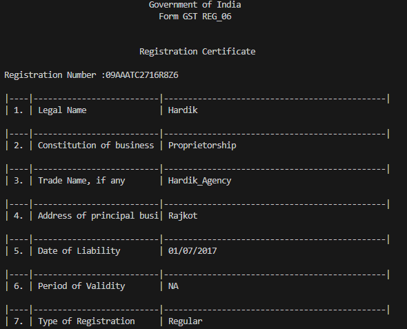
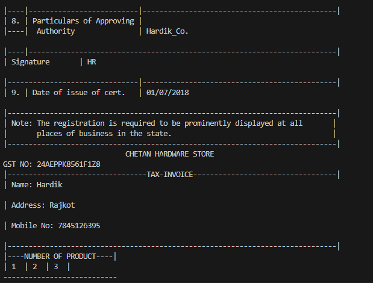
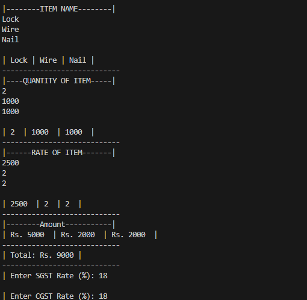
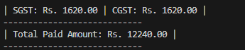

# Dummy GST Certificate & Invoice Printing (C Project)

🚀 **Throwback to My First Semester!**

During my **1st semester of BCA at RK University**, I built this **C project** as part of my learning journey. It allows users to generate a **dummy GST registration certificate and invoice**, utilizing basic **printf, scanf, and arithmetic operations**.

## 📌 Project Overview
This program prompts users for input, such as business details, product names, and tax percentages, and then calculates:
✅ A **formatted GST certificate**
✅ An **invoice with itemized billing**
✅ **SGST & CGST calculations** based on input tax rates
✅ The **final payable amount**

## 📂 Project Structure
```
📁 Dummy_GST_Certificate_Invoice_Printing
 ├── 📄 gstCertificateAndInvoice.c  # Main C program
 ├── 🖼️ Output_part_1.png            # Screenshot 1
 ├── 🖼️ Output_part_2.png            # Screenshot 2
 ├── 🖼️ Output_part_3.png            # Screenshot 3
 ├── 🖼️ Output_part_4.png            # Screenshot 4
 ├── 🖥️ gstCertificateAndInvoice.exe  # Compiled Executable
```

## 📌 How to Run the Program
To execute this program on your system:

1️⃣ **Compile the C file using GCC:**
```sh
gcc gstCertificateAndInvoice.c -o gstInvoice
```

2️⃣ **Run the executable:**
```sh
./gstInvoice
```

## 📌 Sample Output Screenshots
Here’s a look at how the program works:







